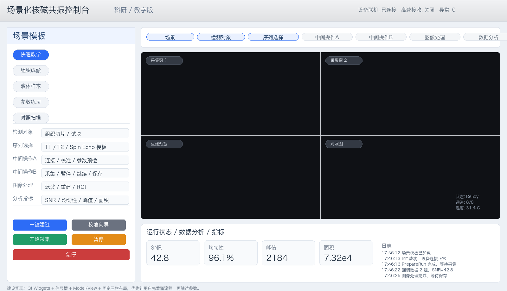

# 场景化核磁共振项目

面向科研与教学的核磁共振上位机项目，目标是把底层 DLL 控制、参数文件、序列流程收束成“场景模板 + 操作向导 + 结果分析”的桌面应用。

## 现在有什么

- `docs/`：产品方案与技术设计
- `prototype/`：静态原型与预览图
- `client/`：Qt/C++ 客户端骨架
- `.harness/`：项目规则、变更记录与交付记忆

## 当前产品方向

- 先做科研与教学场景，不进入临床诊断。
- 先让用户选场景，再展开对象、序列和操作步骤。
- 设备控制保留给适配层，界面只展示必要状态。

## 当前测试边界

| 平台 | 可以测试什么 | 不能测试什么 |
| --- | --- | --- |
| Mac | 原型页面、文档、UI 结构和 Demo 逻辑 | 真实 `mridll.dll` 联机、Windows 设备控制 |
| Windows | Qt 客户端、Demo 模式、真实 `mridll.dll` 接入 | 超出当前科研/教学范围的临床流程 |

## 运行入口

- 原型预览：`prototype/scenario-nmr-prototype.html`
- 产品方案：`docs/scenario-nmr-product-plan.md`
- 技术设计：`docs/scenario-nmr-technical-design.md`
- 客户端说明：`client/README.md`

## SDK 集成现状

客户端已经按真实 SDK 流程预留了接入层，当前支持：

- 加载 `mridll.dll`
- 没有 DLL 时自动回退 Demo
- 按场景模板驱动连接、预检、采集、暂停、急停

真实联机仍建议在 Windows 上验证，Mac 只能验证界面和 Demo 路径。

## Git 边界

- SDK、DLL、设备运行目录、扫描原始数据和构建产物不进入 Git。
- 不同电脑如果本机已经有 SDK，可以直接按 `docs/sdk-local-setup.md` 的约定使用。

## 原型图

